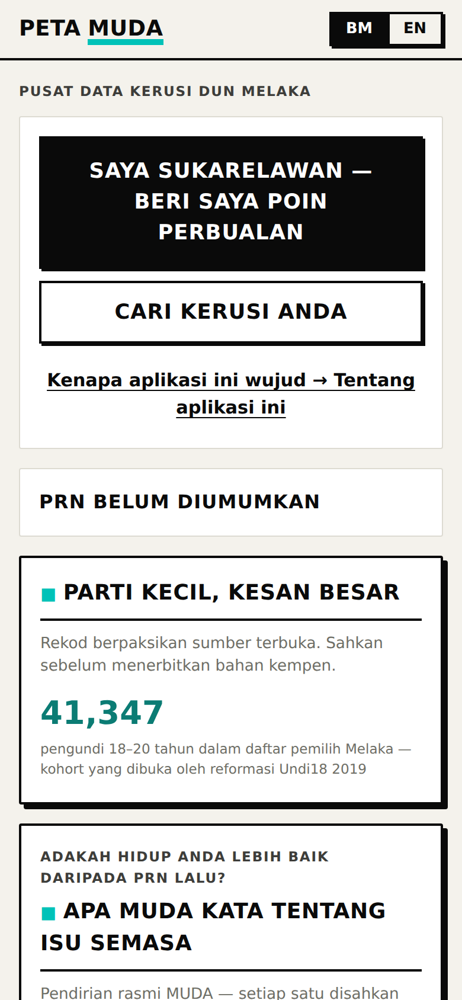
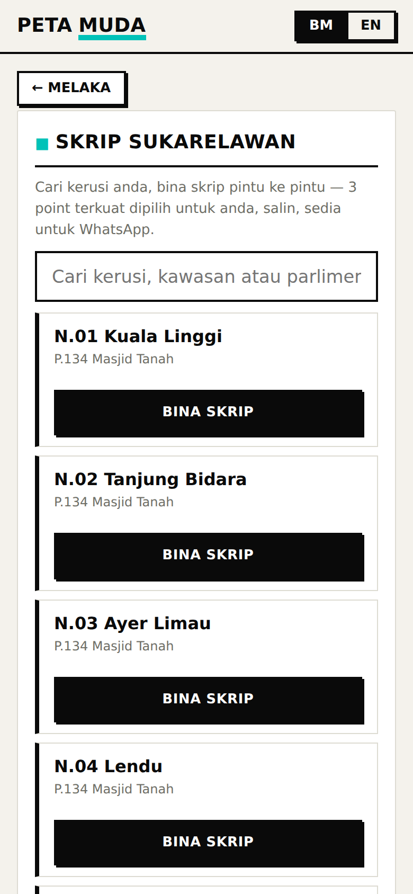
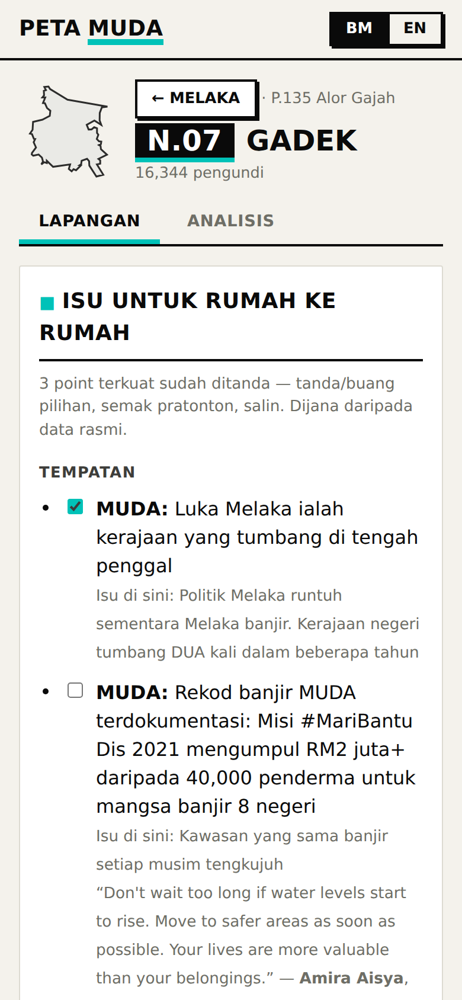
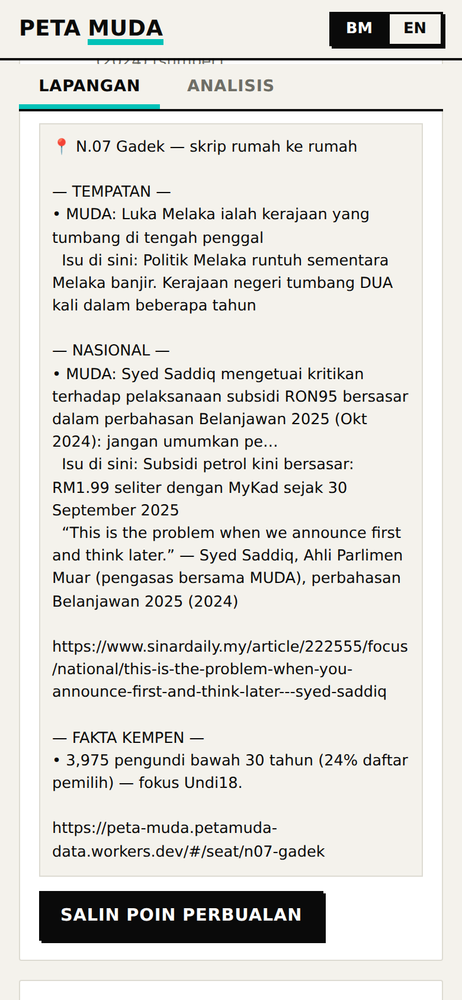
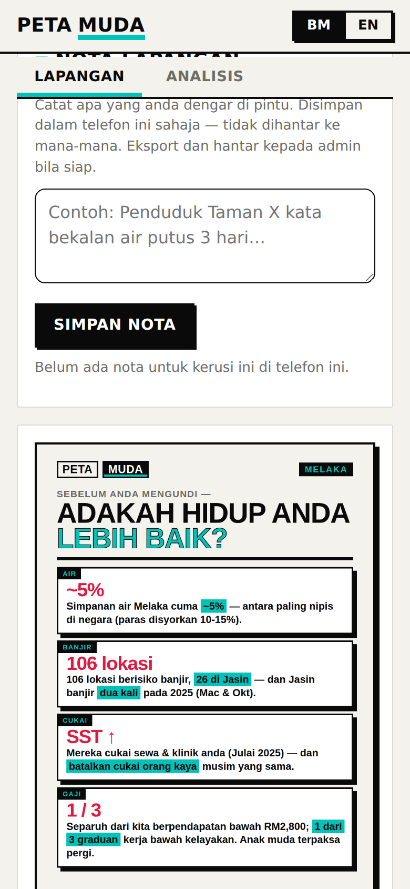
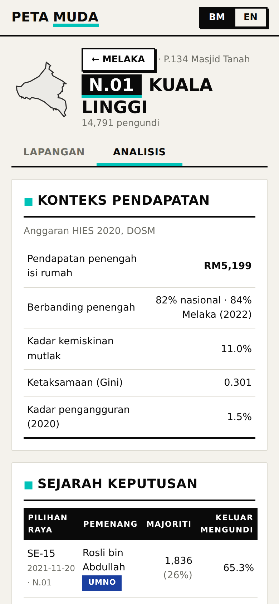

# Peta MUDA — Seat Command Center

[English](README.md) · **Bahasa Malaysia**

**Aplikasi: https://peta-muda.petamuda-data.workers.dev**

**Perisikan kerusi DUN untuk Pilihan Raya Negeri Melaka (PRN Melaka, tarikh belum diumumkan), dibina 100% atas data terbuka.**

## Kenapa aplikasi ini wujud

Aplikasi ini dibina untuk dua masalah khusus di lapangan — bukan sebagai laman kempen am. Ia dwibahasa sepenuhnya (Bahasa Malaysia + English).

**Masalah 1 — sukarelawan sanggup, tetapi kurang yakin.** MUDA ada ramai orang yang sanggup mengetuk pintu; yang kurang ialah orang yang rasa *bersedia* untuk berbuat demikian. Setiap perbualan berisiko ditanya soalan sukar di situ juga — "apa yang salah di sini?", "apa pendirian MUDA tentang X?" — yang memerlukan jawapan benar dan khusus. Tanpa fakta khusus kerusi di tangan, sukarelawan yang sanggup pun teragak-agak, kurang bersedia, atau langsung tak turun padang.

*Jawapan aplikasi ini:* setiap halaman kerusi bermula dengan senarai semak isu tempatan, isu kebangsaan dan babak cerita kempen kerusi itu — tiga terkuat sudah dipilih, satu ketik untuk menyalin. Setiap titik membawa taraf pengesahan (VERIFIED / CONFIRMED / PARTLY CONFIRMED / atau pengakuan jujur "no verified position") supaya sukarelawan tahu betul-betul apa yang boleh dipertahankan. Tiada apa perlu dihafal: semuanya dalam aplikasi, buka je di pintu.

**Masalah 2 — pengundi dah tak mahu buka pintu untuk politik.** Keletihan janji adalah rasional: bertahun-tahun janji parti yang tak bertahan selepas kerajaan dibentuk telah mengajar orang untuk tak harap apa-apa yang baharu. Sesiapa di pintu dianggap menjual manifesto lain — jadi pintu kekal tertutup. Lebih banyak janji, walaupun ikhlas, hanya mengesahkan corak itu.

*Jawapan aplikasi ini:* fakta, bukan janji. Setiap kad menyatakan sesuatu yang *berlaku* — potongan subsidi, banjir, angka gaji, majoriti undi — khusus untuk **kerusi ini**, bukan skrip kebangsaan. Pendirian MUDA hanya muncul dengan orang bernama, jawatan, tarikh dan sumber; jika tiada yang disahkan, aplikasi kata begitu dan bukan mereka-reka. Jika MUDA mengaku kredit, ia untuk sesuatu yang sudah dibuat dan boleh disahkan secara bebas.

**Dan sebelum sampai ke pintu:** setiap kerusi ada poster sedia-WhatsApp yang menunjukkan angka kerusi itu sendiri, bukan slogan — dimaksudkan untuk dihantar oleh jiran atau kawan yang pengundi itu benar-benar percaya, supaya ketukan pintu bukan satu permulaan yang dingin.

## Cara menggunakannya — panduan bergambar

Perjalanan sukarelawan, dari mula hingga akhir. (Aplikasi ini mengutamakan BM; suis BM|EN di bahagian atas menukar segala-galanya, poster sekali.)

### 1. Buka aplikasi, nyatakan anda sukarelawan



Skrin utama bertanya apa yang anda mahu buat, bukan data apa yang anda mahu. Ketik **"Saya sukarelawan — beri saya poin perbualan"**. (Pengundi dan penganalisis ketik "Cari kerusi anda" dan tiba di halaman kerusi yang sama.)

### 2. Pilih kerusi anda di hab sukarelawan



Kesemua 28 kerusi Melaka, boleh dicari mengikut kerusi, kawasan atau nama parlimen. Ketik **"Bina skrip"** pada kerusi anda.

### 3. Bina skrip rumah ke rumah anda



Setiap isu tempatan, isu kebangsaan dan babak cerita kempen bagi kerusi itu ialah senarai semak — **tiga terkuat sudah ditanda**. Tanda atau buang tanda mana-mana titik dan ia serta-merta ditambah atau dibuang daripada skrip anda di bawah — **hanya apa yang anda pilih masuk ke dalam salinan akhir**, tiada lebih. Setiap titik bermula dengan apa yang MUDA kata atau buat, kemudian isu tempatan sebagai konteks.

### 4. Salin dan pergi



Pratonton itu ialah skrip tepat anda — poin MUDA-dahulu, petikan bersumber kata demi kata, fakta kempen kerusi itu. **"Salin poin perbualan"** meletakkannya pada papan keratan anda: tampal ke WhatsApp, aplikasi nota anda, di mana sahaja anda akan melihatnya di pintu.

### 5. Sebelum berjalan: hantar poster kepada orang yang anda kenal



Setiap kerusi ada poster sedia-WhatsApp yang menunjukkan **angka kerusi itu sendiri** — tiada slogan, tiada URL (ia untuk pengundi; aplikasi ini untuk anda). Dihantar oleh jiran atau kawan, ia memanaskan pintu sebelum anda mengetuk. Catat apa yang anda dengar di pintu dalam **Nota lapangan** (disimpan dalam telefon anda sahaja — eksport kepada admin anda bila siap).

### 6. Persediaan lebih mendalam, bila anda mahu



Tab **Analisis** ada sejarah keputusan penuh kerusi itu, profil pengundi (umur/etnik), dan pendapatan berbanding penengah nasional dan negeri. Butang **"Poin perbualan terpilih"** pada tab Lapangan mengeksport dossier bersumber penuh kerusi itu sebagai fail — tampal ke ChatGPT/Gemini dan berlatih soalan sukar sebelum pintu pertama anda.

Satu halaman bagi setiap kerusi DUN, dua kedalaman untuk dua khalayak:

| Tab | Khalayak | Apa yang ditunjukkan |
|---|---|---|
| **Lapangan** (Field) | Calon & sukarelawan | Poin perbualan rumah ke rumah dijana automatik (isu tempatan + kebangsaan + cerita kempen, MUDA-dahulu), poster boleh kongsi, maklumat keluar mengundi sebaik tarikh mengundi ditetapkan, nota lapangan |
| **Analisis** (Analysis) | Ibu pejabat kempen | Sejarah keputusan penuh, profil daftar pemilih 2026 (umur / etnik), pendapatan berbanding penanda aras nasional/negeri, eksport JSON/CSV |

Hab sukarelawan (`#/volunteer`) membina skrip rumah ke rumah bagi setiap kerusi dengan satu ketik: tiga point terkuat sudah dipilih, boleh diubah, dan disalin terus ke papan keratan.

## Sumber data (semua percuma, tanpa kunci)

| Sumber | Apa yang kami ambil | Lesen |
|---|---|---|
| Data terbuka [ElectionData.MY](https://electiondata.my) / [MECo](https://github.com/Thevesh/paper-meco-results) | Keputusan 1955–kini, demografi **pengundi berdaftar setiap kerusi — umur, jantina, dan etnik** (daripada parquet `seat_info` daftar GE-15 2022), GeoJSON sempadan | CC0 |
| [data.gov.my](https://developer.data.gov.my) / OpenDOSM | `hh_income_dun`, `hh_poverty_dun`, `hh_inequality_dun`, `lfs_dun`, GeoJSON DUN, CPI | CC BY 4.0 |
| `data/manual/melaka/issues.json` dikurasi tangan | Isu kempen tempatan + kebangsaan yang disemak fakta, setiap satu membawa taraf pengesahan bersumber (VERIFIED / CONFIRMED / PARTLY_CONFIRMED / REPORTED / NO_VERIFIED_POSITION) | — |

PRN Johor (mengundi 11 Julai 2026) telah bersara sepenuhnya: tiada apa berkaitan Johor berjalan dalam CI lagi, dan saluran paip warisannya (`pipeline/run.mjs`) wujud hanya sebagai kod tidak aktif dalam repo. Kandungan dikurasi dikekalkan terkini oleh sapuan berita automatik harian (10:00 MYT) yang menyemak fakta dan menolak di bawah peraturan taraf pengesahan.

## Guna ia

**Tiada apa perlu dipasang — buka sahaja https://peta-muda.petamuda-data.workers.dev pada telefon anda.**
Tambah ke skrin utama untuk akses satu ketik (Kongsi → Tambah ke Skrin Utama); data menyegar
sendiri setiap hari. Pembangun: arahan bina setempat ada dalam [HANDOFF.md](HANDOFF.md).

Laman ini statik sepenuhnya (`site/`) — Cloudflare Workers Builds mengerah secara automatik pada setiap
tolakan ke `main`. `.github/workflows/refresh.yml` membina semula data Melaka setiap hari (10:30 MYT) dan
pada mana-mana tolakan yang menyentuh `pipeline/**` atau `data/manual/**`.

## Seni bina

```
pipeline/
  config.mjs             skop STATE/EDITION, kerusi sasaran
  run_melaka.mjs          orkestrator Melaka (cermin MECo + sosio DOSM + etnik daftar pemilih)
  run.mjs                 orkestrator Johor warisan
  lib/                    fetch (cuba semula+cache), penghurai CSV, parquet (hyparquet)
  steps/                  satu modul bagi setiap sumber: seats, history, demographics, geo, alerts
site/                     aplikasi statik (tiada langkah bina): index.html, app.js, styles.css
data/manual/               nota boleh sunting, bersumber: melaka/issues.json, income_benchmarks.json,
                            muda_stances.json, national_issues.json, muda_record.json
data/derived/              petikan binaan tersimpan: melaka_roll_ethnic.json (etnik daftar pemilih,
                            diambil dalam CI, diguna semula oleh binaan luar talian), price_history.json, alerts_*.json
tools/serve.mjs            pelayan pembangunan
tools/smoke.mjs            suite regresi Playwright headless (~76 semakan)
tools/poster/               penjanaan PNG poster (dwibahasa, setiap kerusi + seluruh negeri)
```

## Batasan yang jujur

- Tarikh PRN Melaka belum diumumkan — aplikasi menunjukkan "Election not yet called"
  dan bukan kiraan hari sehingga SPR menetapkan satu.
- HIES pendapatan/kemiskinan hanya wujud untuk 2019/2022/2024; pendapatan peringkat kerusi Melaka ialah
  satu anggaran 2020 sahaja yang dibandingkan dengan tahun penanda aras sepunya terdekat.
- Etnik pengundi ialah pecahan **pengundi berdaftar** daripada daftar GE-15 (2022) — daftar
  Melaka terkini yang diwartakan sehingga PRN akan datang diumumkan. Jika sumber itu tidak
  tersedia semasa binaan, aplikasi berbalik kepada bahagian penduduk banci 2020 yang berlabel
  (didedahkan dengan jelas sebagai data penduduk, bukan daftar pemilih).
- Penafian dalam aplikasi meminta pengguna mengesahkan fakta sebelum menerbitkan bahan kempen.

## Lesen & kredit

Kod: MIT. Data: lesen setiap sumber di atas. Dibina dengan Malaysian Election Corpus
(Thevesh Theva et al., CC0) dan data terbuka DOSM/JDN.
